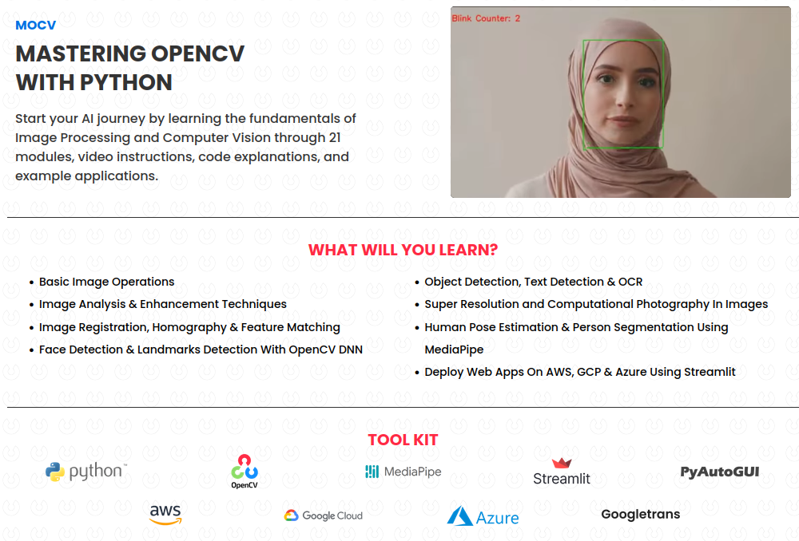
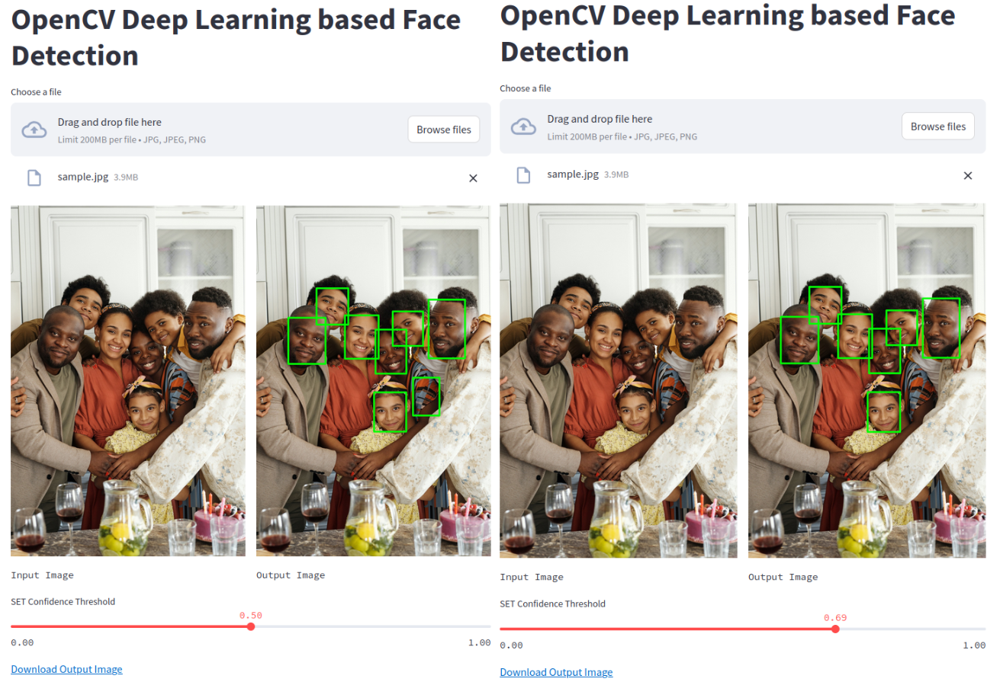

# Mastering OpenCV

Coursework provided by OpenCV University 

|

|

|

## Module 1: Getting Started with Images

Learning how to read in, modify, annotate, save, and display images

The image New_Zealand_Boat.jpg is read into openCV, cropped, resized to double the size, and flipped

The image Apollo-11-launch.jpgis read into openCV, text is added, and a rectangle is placed on the shuttle rocket

|

|

|

## Module 2: Arithmetic Logic and Thresholding

Learning how to change brightness, contrast, create binary masks, combine images, and remove backgrounds using alpha channels

The contrast is modified using matrix multiplication

Thresholding is used to create binary masks where musical notes exist

The background of this sign JPEG image was removed, using binary masks to isolate the non-background component of the image, and merging this mask as the alpha channel to form a PNG

An openCV logo watermark was placed on this image using masks and cv2.addWeighted()

An e-signature transparent png was created from a handrawn signature imported as JPEG

|

|

|

## Module 3: Histograms and Color Segmentation

Learning how to analyze the distribution of values aross channels of an image, and techniques to improve image quality or segment images from this

The histograms of multiple channels of an image, or even the mask of an object in an image, can be plotted

Histogram equalization can be used across multiple channels to improve contrast of an image. HSV equalization is best for color images

Color Segmentation across HSV values using cv2.inRange() can be used to isolate an object in an image into a mask, such as this New Zealand lake

An application of color space segmentation to analyze deforestation over the years is explored

GeoTIFF LandSAT 7 channel images are used to accurately determine the loss of vegetation over time, as the near infrared channel enables segmentation using NDVI method to determine the color space of vegetation

|

|

|

## Module 4: Video Processing and Analysis

Learning how to read video files, edit frames, and write video files using openCV

An application of video processing (motion detection through using binary masks generated by subtracting prior frames from current frames and eroding away noise) is explored

Binary masks such as these could be thresholded to determine if motion is detected (if enough pixels are not zero, notable motion has occured -> trigger event)

|

|

|

## Module 5: Contour Analysis

Learning how to identify contours using openCV, and openCV functionality to obtain parameters like center of mass, bounding boxes / circles, area, and perimeter

The previous motion detection application is extended to an intrusion detection application where the foreground binary mask is processed to obtain contours and the bounding box of the largest contour present

|

|

|

## Module 6: Playing Games with HCIs

Learning how to use PyAutoGUI as a Human Computer Interface to turn a facial detector into a video game controller that emulates arrow key presses

Here I am playing Pacman:

Here I am playing Subway Surfers:

|

|

|

## Module 7: Streamlit

Learning how to use Streamlit to create web apps without needing to use HTML, CSS, Javascript, or web hosting

Here is a Streamlit WebUI created to take an image and return an annotated image with the detected faces above a certain confidence interval, determined by a slider:

|

|

|

## Module 8: Image Filtering

Learning how to use convolution kernels across an image as filters

Examples covered include blurring / sharpening images, detecting edges, or applying stylistic image filters

Here is a Canny edge detection filter applied directly to my own camera feed frame by frame

")

Here is a Streamlit webUI created to apply the different image filters on an input image

