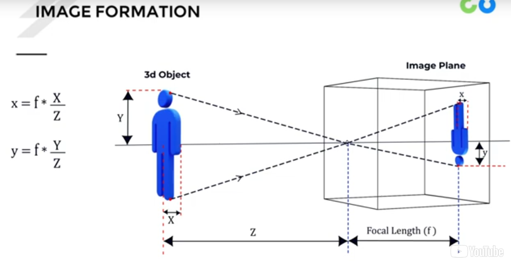
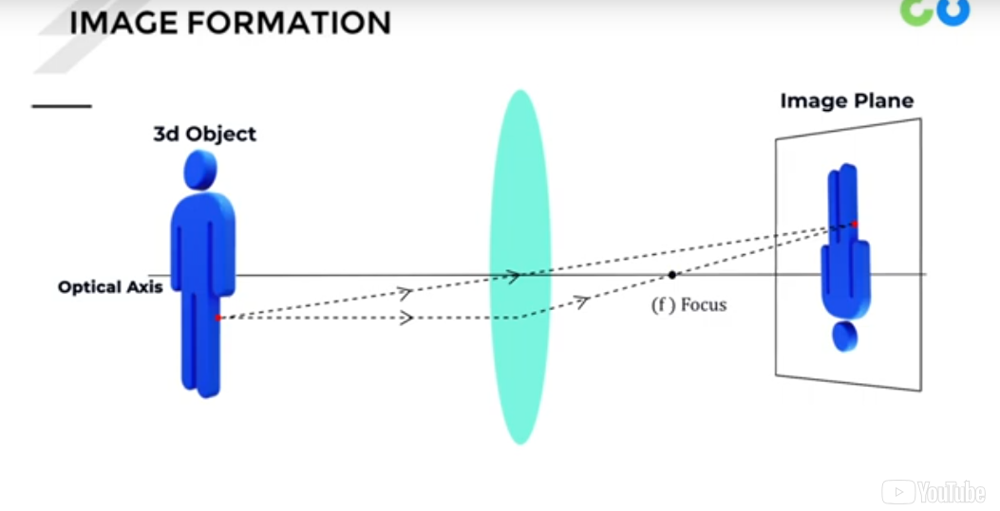
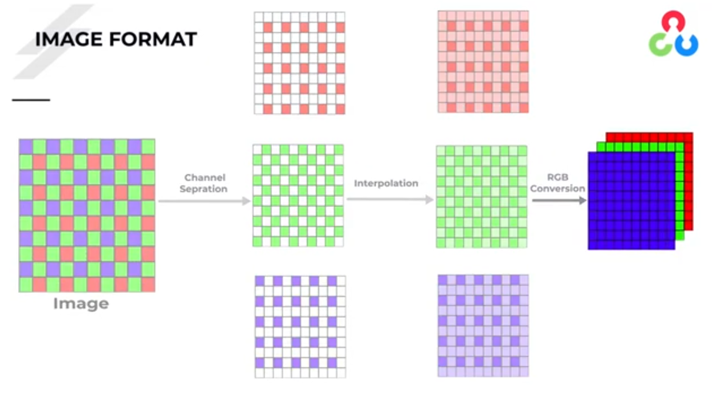
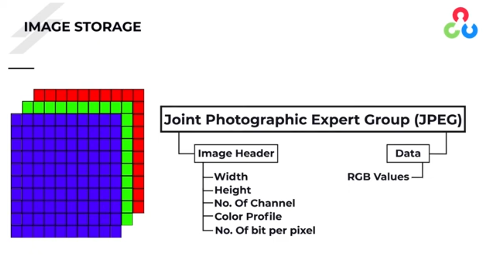
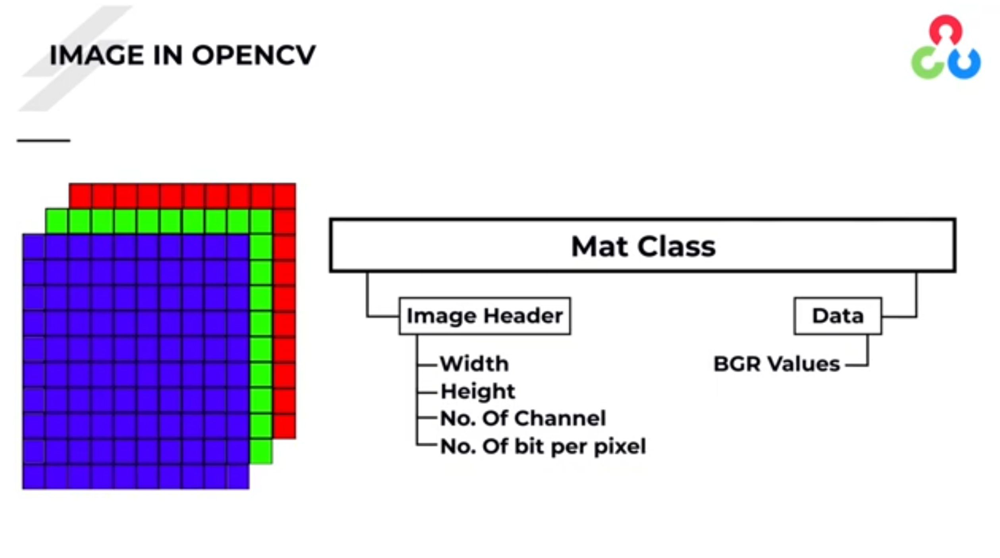
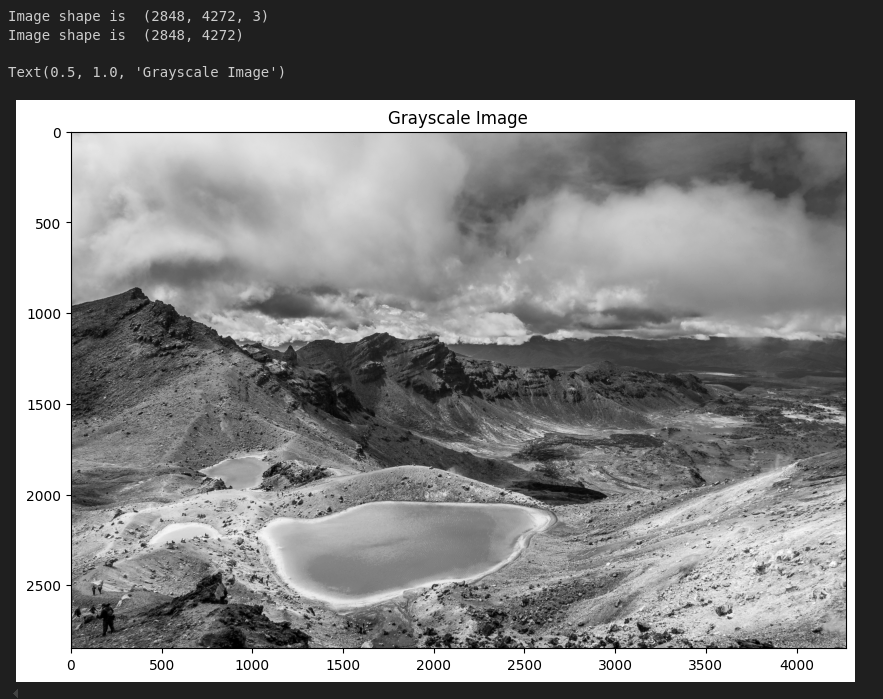
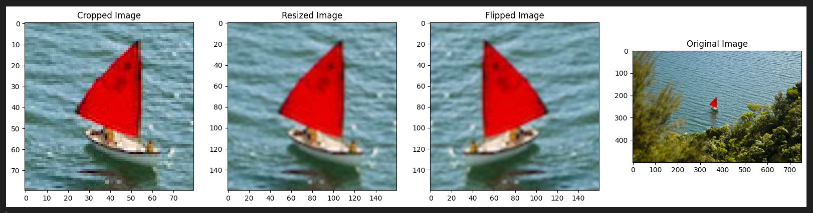
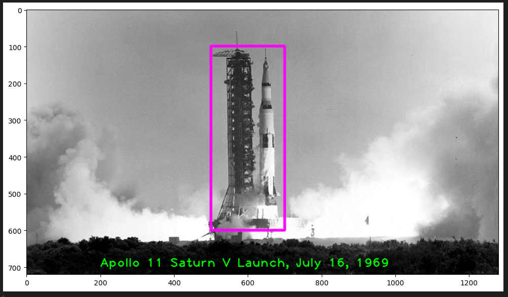

# Module 01: Getting Started With Images

## Image Basics

### Geometry of Image Formation 

Understanding the theory of how an image is formed and camera intrisnics

In this simplified camera model, the pinhole size and focal length can be used to determine the expected size of an object, and its relationship to distance from the camera

In order to keep an object in focus across a lense, the object must be projected within an intersection plane between a ray across the center of the lense and a ray normal to the lense

### Digital Image Formation

Understanding the formation of digital color images and formatting used in openCV

Each of RGB color channels is generated on separate cells of a matrixed light sensor, and demoized to interpolate neighboring values, forming a complete color image

The data structure of a JPEG image

The data structure of an openCV C++ implementation Matrix (Mat) class image

### Image Formats

Understanding the history of image formats and their use cases

.gif

    - Useful in repeating moving image but memory dense

.png

    - Lossless image compression (good for maintaining details)
    - supports alpha channel

.jpg / .jpeg

    - Lossy image compression (leaves artefacts in image)
    - no alpha channel

.webm

    - Lossless and Lossy image compression
    - More memory efficient than PNG
    - Developed by Google under BSD license
    - Not widely adopted yet :(

## Module Projects

### M01.01: Reading, Displaying, Saving Images

Exercises to read image formats into openCV, view matrix data struccture, display images in line, and save images

The image Apollo-11-launch.jpg was read into openCV, displayed in jupyter notebooks, and saved to a png as Apollo-11-launch-edit.png

### M01.02: Color Images

Exercises to modify channels of color images, convert to different color formats, and ensure appropriate use of channels per image format

The image Emerald_Lakes_New_Zealand.jpg is read into openCV, converted to grayscale, and displayed with attribute data

### M01.03: Basic Image Manipulation

Exercises to copy images, manipulate pixel values, crop, resize, and flip images

The image New_Zealand_Boat.jpg is read into openCV, cropped, resized to double the size, and flipped

### M01.04: Annotating Images

Exercises to draw lines, circles, rectangles, and add text to images

The image Apollo-11-launch.jpgis read into openCV, text is added, and a rectangle is placed on the shuttle rocket

