# Module 2: Arithmatic and Logical Operations

## Module Projects

### M02.01: Arithmetic Operations

Exercises to modify the brightness and contrast of images through addition, subtraction, and multiplication

The image Santorini.jpg was read into openCV and the contrast is modified using multiplication. Numpy's clip function is used to solve the overflow issue in the first set of images

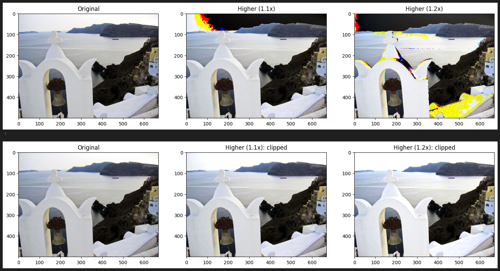

|

|

|

### M02.02: Thresholding

Exercises to extract a selective binary image from a grayscale image, either through global thresholding ranges or through an algorithm

The image Sheet_Music_Test-1.jpg was read into openCV and global thresholding is used to produce an inverse binary image of the sheet music where the notes have non zero values

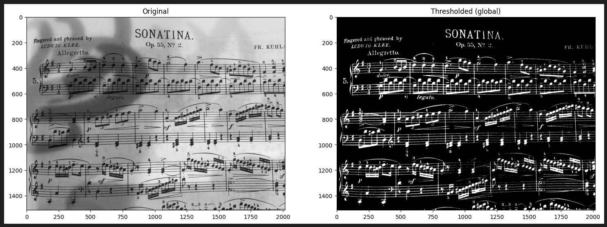

|

|

|

### M02.03: Logical Operations

Exercises to familiarize with bitwise and, or, xor, and not logical operations

The first exercise provides the two images below and asks us to create the third

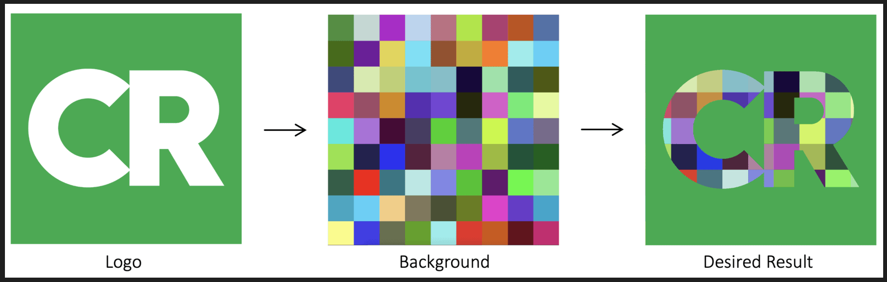

This requires creating a binary mask and an inverse binary mask, and using the bitwise logical operations on them with the desired texture

The set of masks output can be added to produce the desired image

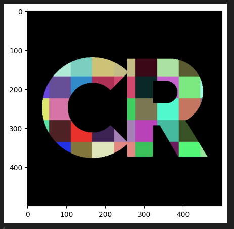
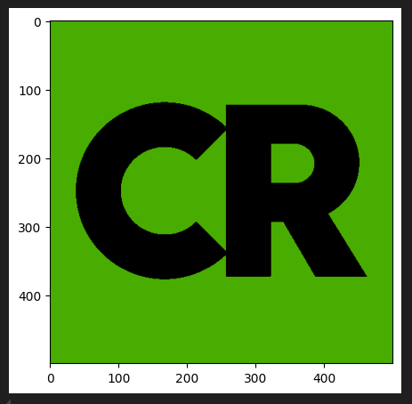

The second exercise similarly asks us to create an image from the masks of two images

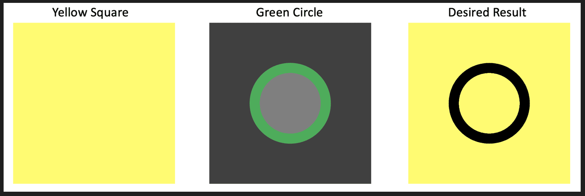

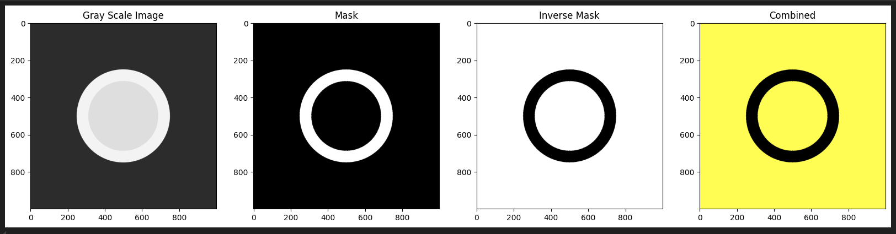

|

|

|

### M02.04: Alpha Channel

Exercises to familiarize with the PNG alpha channel and how it can be used to remove a background from a JPEG

In the exercise, the kangaroo sign JPEG is imported as grayscale, converted into an inverse binary mask, and that is merged with the split RGB split of the JPEG to produce a no background sign

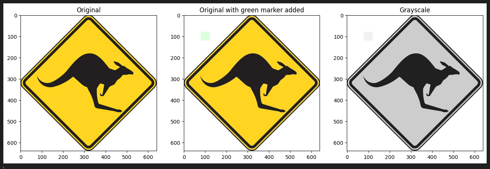

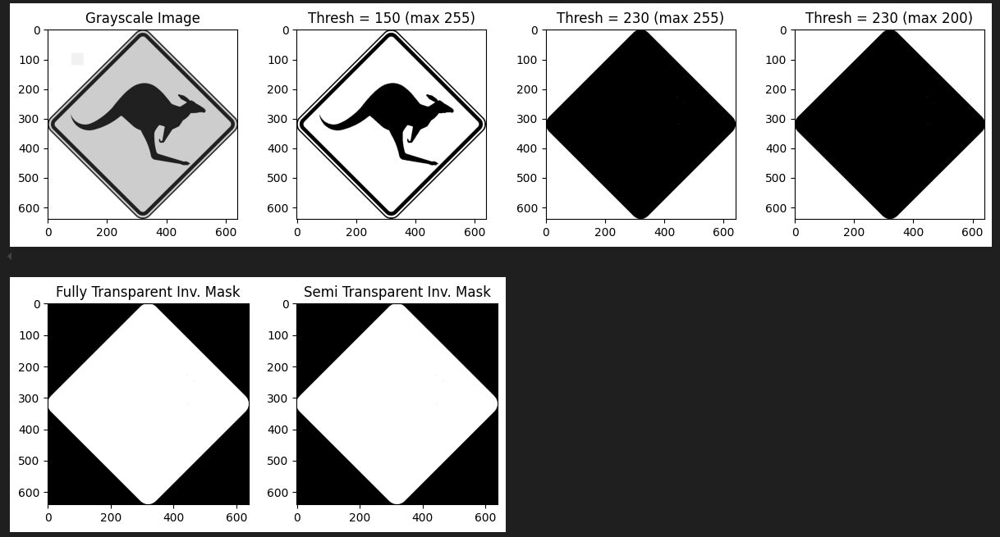

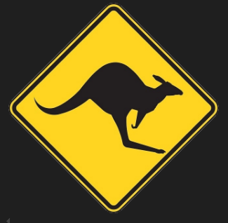

|

|

|

### M02.05: APPLICATION: Watermarking an image

Exercises to understand how an image watermark is generated

In the first exercise, the pipeline to generate a solid watermarked image is created

We are tasked with taking the openCV logo and placing it over the image below

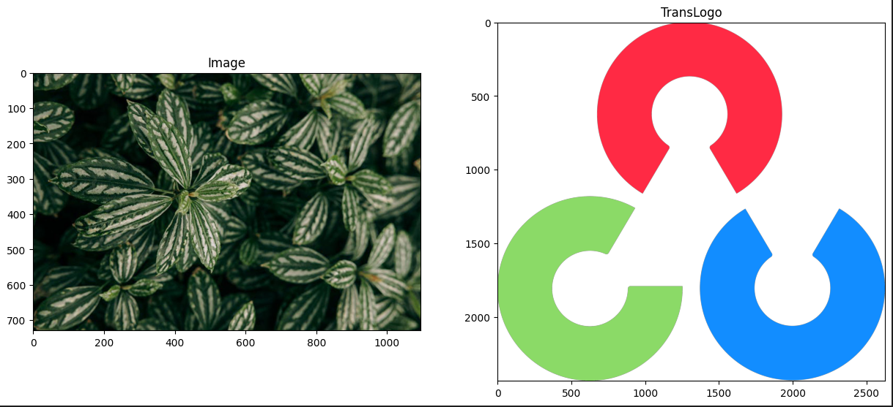

1. scale down the watermark to an appropriate size, and generate a binary mask

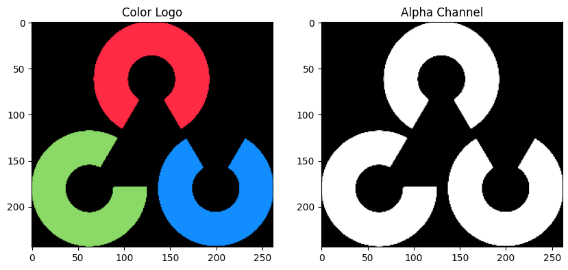

2. Identify the location (Region of Interest) to place the watermark into on the image. 
* the centerpoint and size of the watermark binary mask will be used to compute rows, cols for the region of interest

3.Extract the ROI from the original image
* use regular and inverse binary masks to produce componets to add

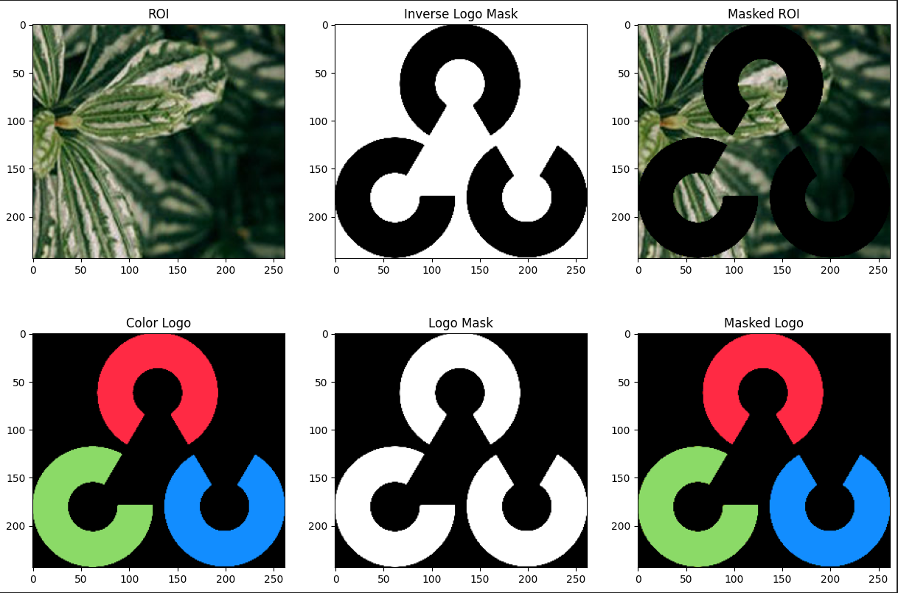

4. Add the new masks together to produce a watermarked ROI

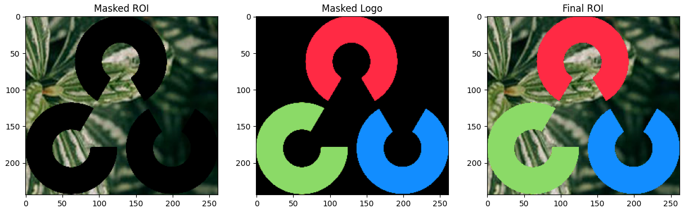

5. Use pixel ranges for the ROI to replace pixel values on the original image with pixel values from the combination of the masks generated

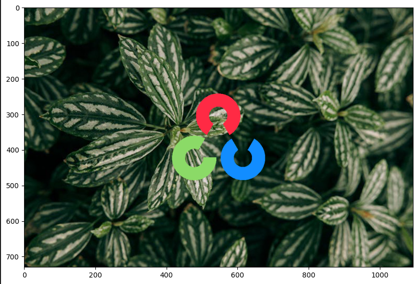

In the second exercise, the pipeline above is modified to add transparency to the watermark

This is accomplished by using the cv2.addWeighted() function with the unedited ROI and color logo mask

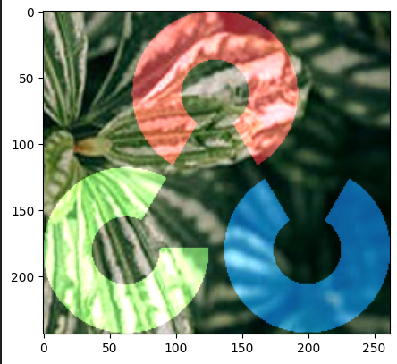

Using pixel assignment just like before in step 5 will yield a complete image with the transparent logo

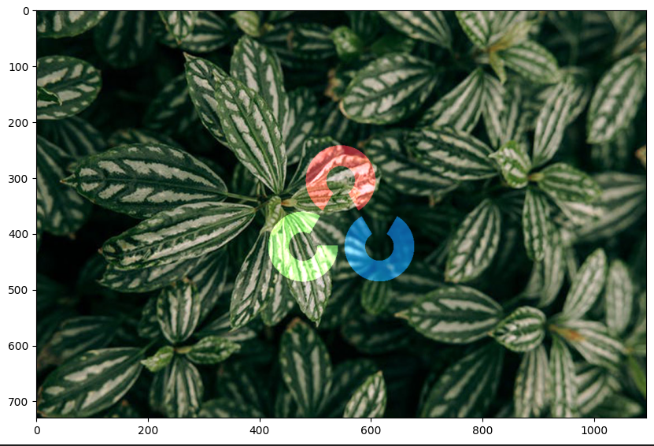

|

|

|

### M02.06: APPLICATION: Digital Signature

Exercises to understand how to convert a hand-drawn signature into a PNG with transparency for e-signing documents

In the exercise, the pipeline to generate a PNG signature with a selected color is created

The following hand drawn signature is provided

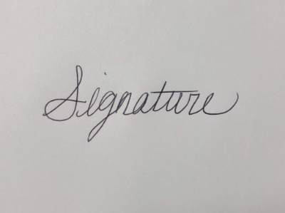

1. The image is read into grayscale and cropped to a ROI

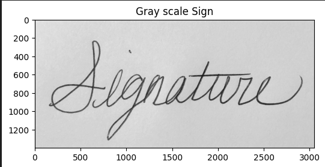

2. This grayscale image is converted into an inverse binary mask

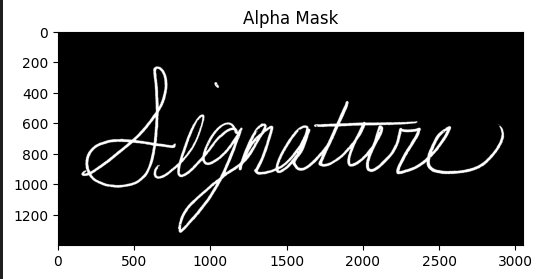

3. A color block of equal size is generated, and this inverse binary mask is combined with it using cv2.addWeighted

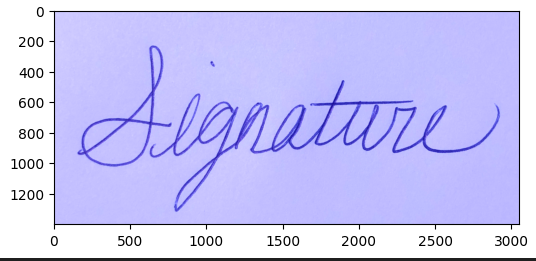

4. This combined colored block is split into BGR channels, and merged with the inverse binary mask as the A channel into the final image, which can be saved as a PNG

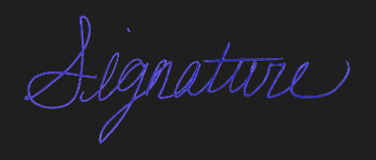

5. The PNG can be imported into documents and placed as an e-signature

