# Module 3: Histograms and Color Segmentation

## Module Projects

### M03.01: Histograms

Exercises to obtain the distribution of values across channels of an image, and initial discussion of the use cases

The grayscale Apollo-8-Launch.jpg histogram is found using two methods:

 linear plot versus hist() histogram")

The concept of histogram binning is best explained with this histogram of a checkerboard, containing values of either 0 or 255 at each pixel

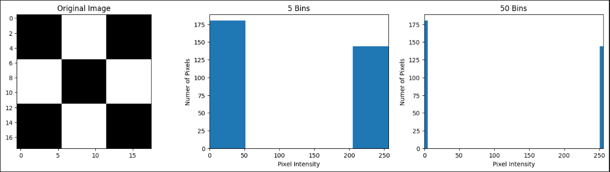

calcHist() linear plots are partciularly helpful for viewing histogram distributions across different channels

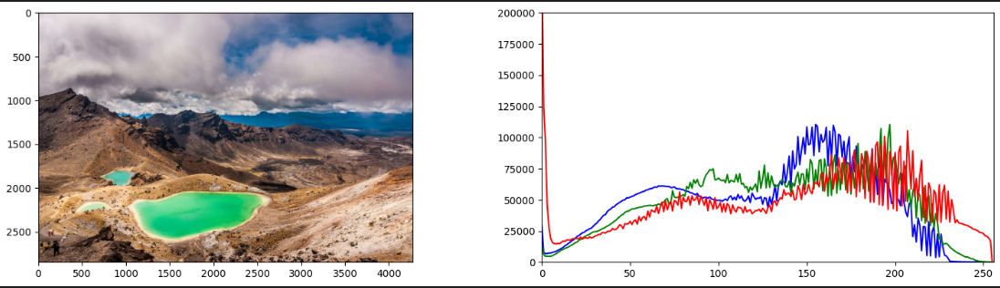

Binary masks + bitwise operations can be used to isolate an object and perform histogram analysis only on that object. In this case, a square was simply pulled from the lake of the Emerald_Lakes_New_Zealand.jpg above

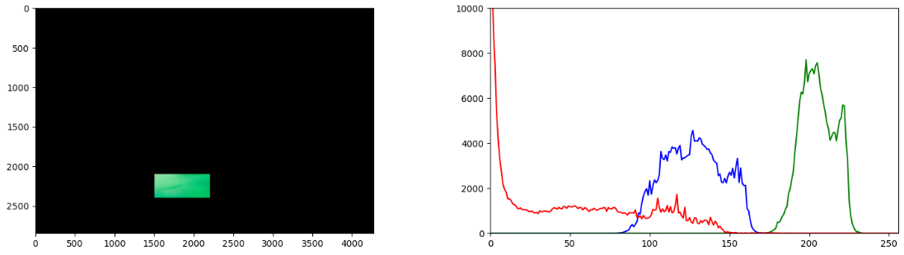

A good use case of histograms is improving contrast in an image through histogram equalization, as demonstrated below with parrot.jpg

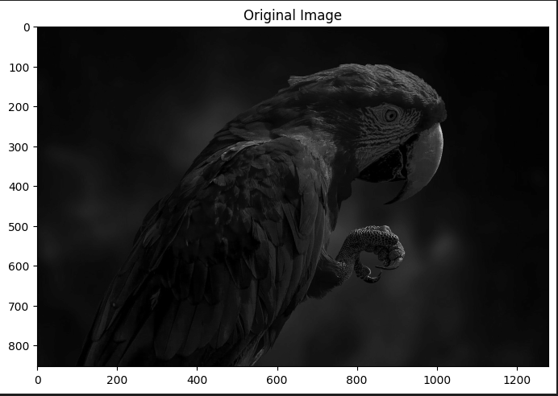
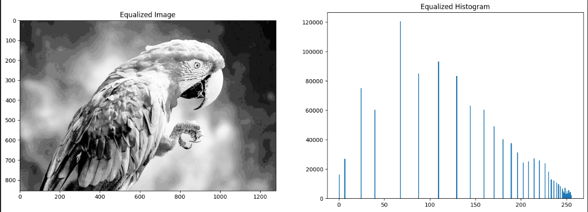

The same method used in the grayscale image above does not work well with BGR color channels due to the dependency of intensity on hue, thus it is better to first convert to HSV format

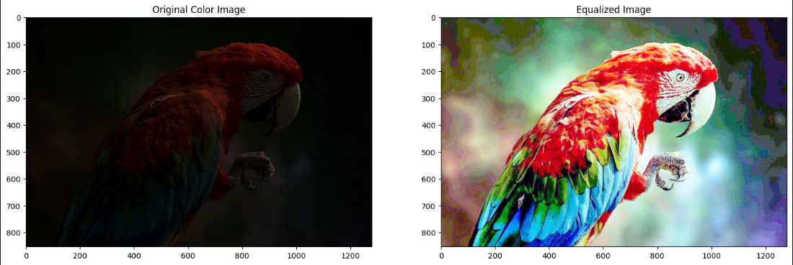
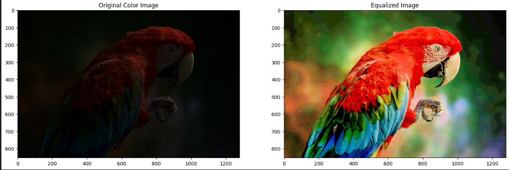

The grayscale version of the equalized HSV parrot image has a better equalized histogram distribution than before due to the accounting of intensity

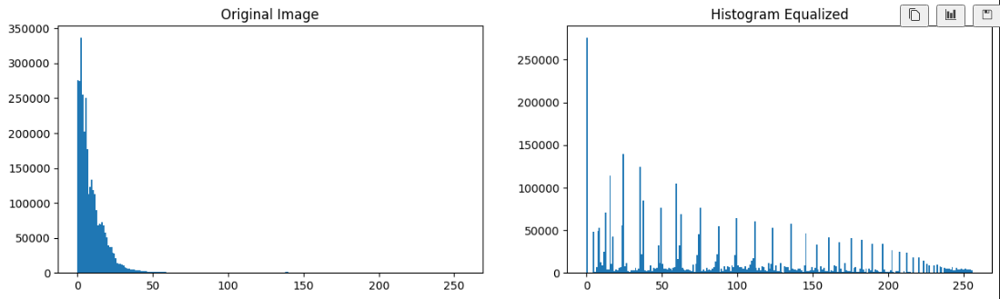

|

|

|

### M03.02: Color Segmentation

Exercises to isolate components of an image by color using HSV channels

This plot of Hue vs Saturation is helpful in identifying which bands of values should be used to isolate a color

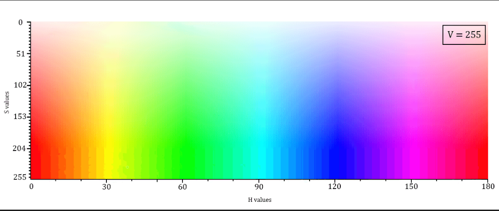

This is a good visual to understand color segmentation. The openCV logo is segmented into masks by red, green, and blue colors

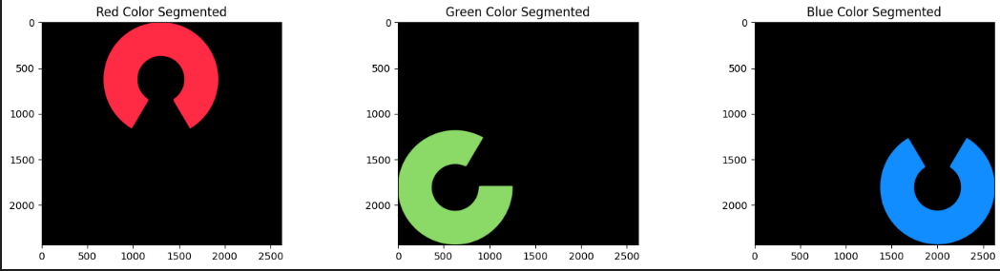

In the exercise, I identified the HSV lower and upper band to create a mask of the New Zealand lake using cv2.inRange()

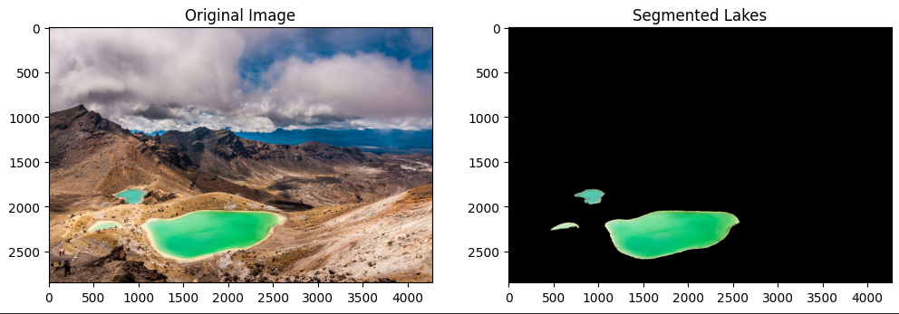

|

|

|

### M03.03: APPLICATION: Deforestation using Color Segmentation

Exercises to use color segmntation to analyze deforestation

Four satellite images of an area across different years are provided

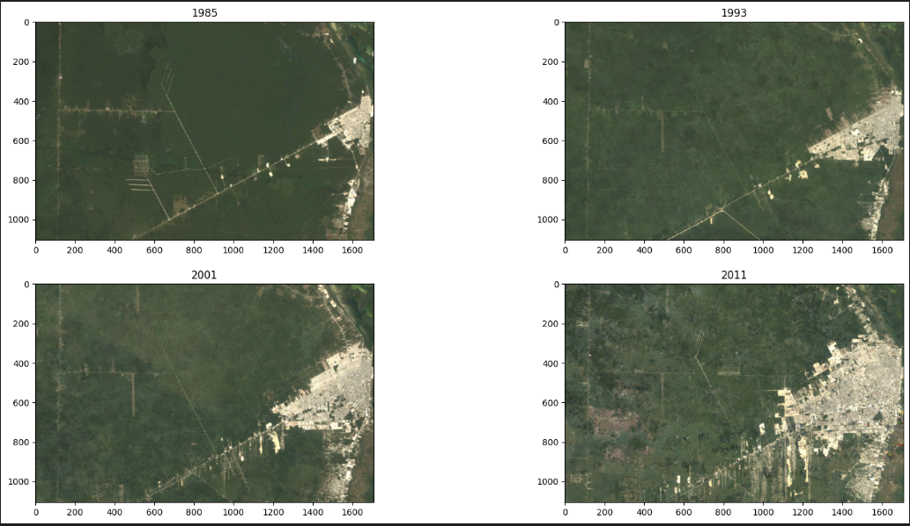

These images can be split into different color channels (BGR) to obtain the histograms

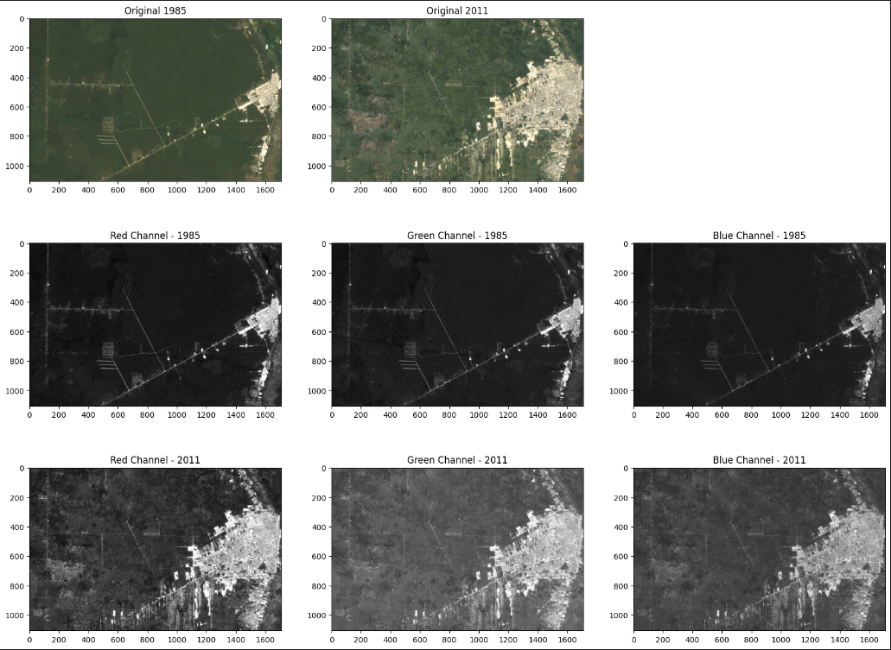
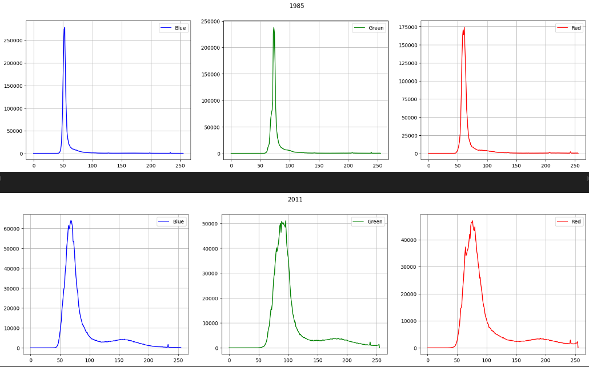

From the histograms, the range of values to be used with the inRange function can be determined, and a binary mask of the forest can be generated

In this case, the binary mask is generated by filtering the green values

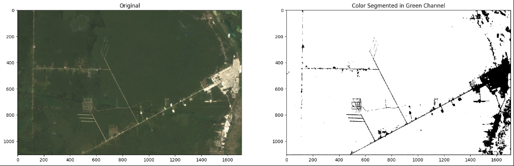

Alternatively, histograms and inRange can be used with the HSV color space instead of BGR

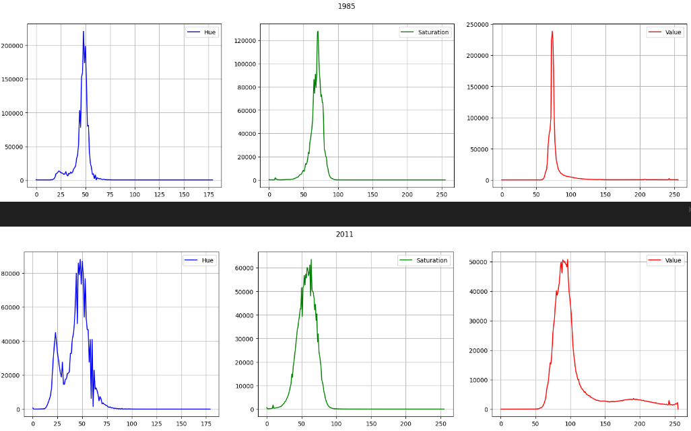

With the binary mask generated, the percentage of non-zero values represents the amount of forest remaining. Here, BGR and HSV analysis are compared

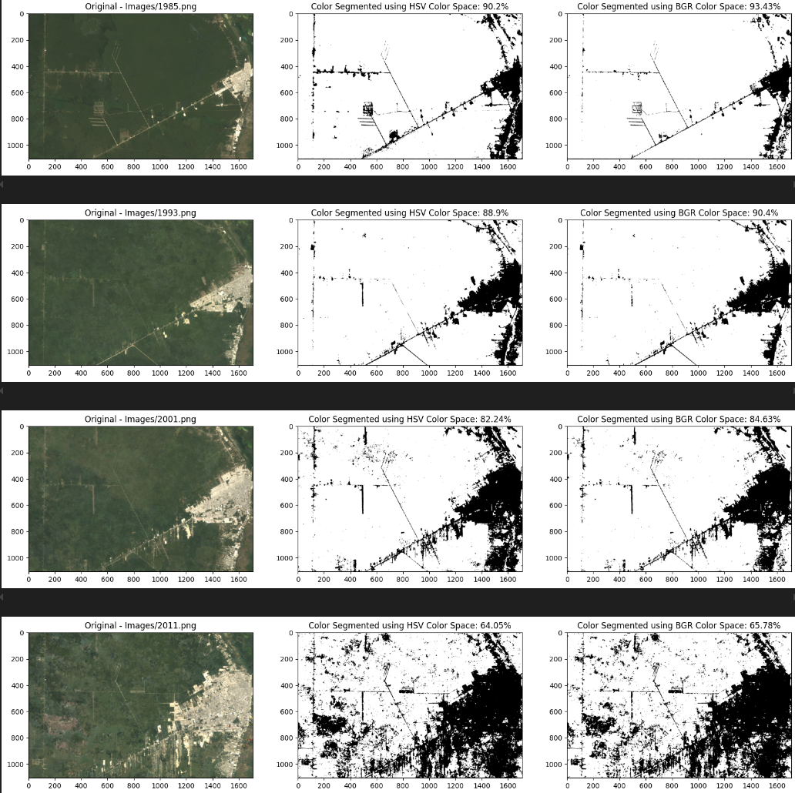

|

|

|

### M03.04: APPLICATION: Deforestation using GeoTIFF satellite LandSAT channels

Expanding on previous application by using 7 channel LandSat GeoTiff images with the NDVI method to obtain vegetation spectrum from an image and more accurately determine deforestation

The 7 channels of the satellite imagery are detailed below

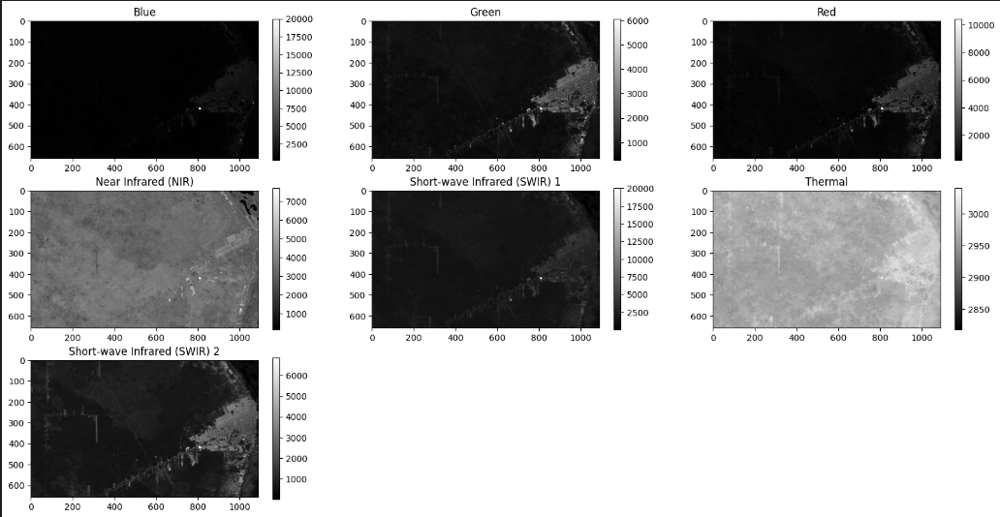

The Normalized Difference Vegetation Index (NDVI) method can be used to calculate a better approximation of vegetation in the image, where these NDVI image binary masks can more accurately determine percentage of vegetation remaining and thus, deforestation rate

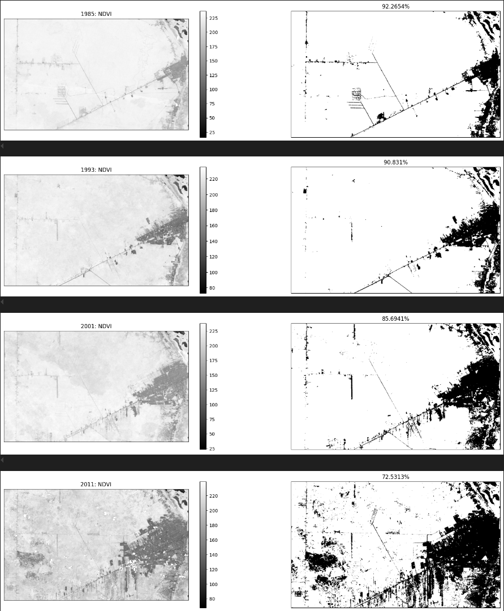