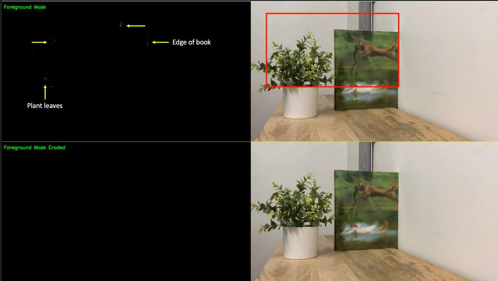
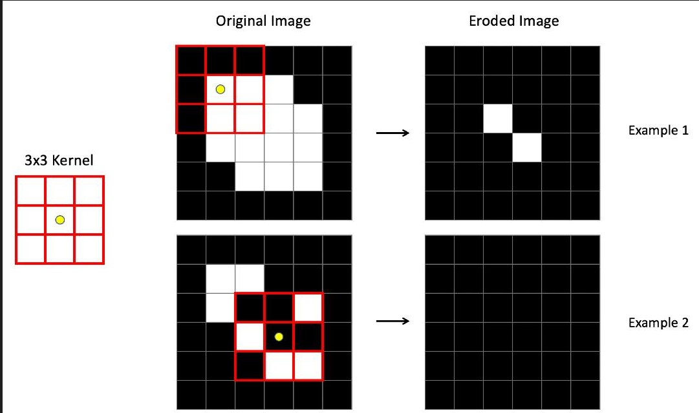
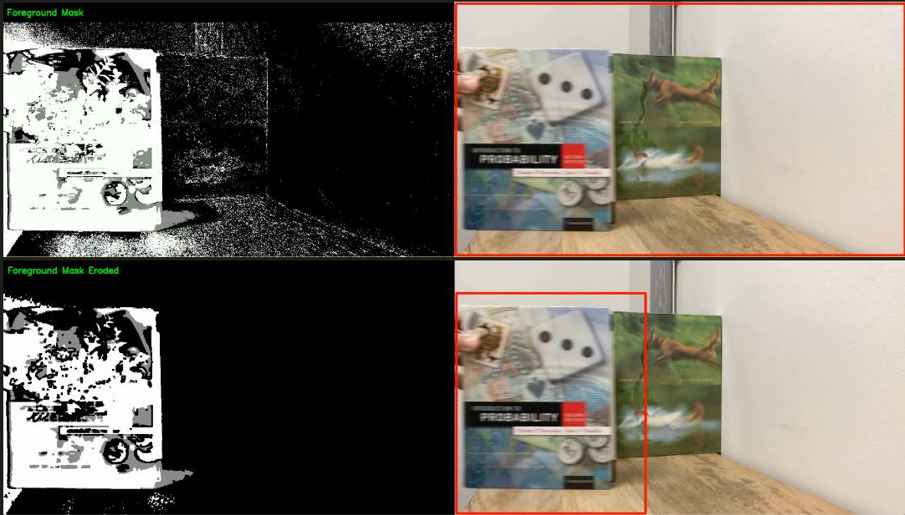

# Module 4: Video Processing and Analysis

## Module Projects

### M04.01: Reading and Streaming Video

An exercise to understand how to read a video file into a cv2 data structure, and output its frames to a GUI at a specific rate or upon events

The video race_car_slow_motion.mp4 is read in using cv2.VideoCapture, and played at 1 frame every 1 ms (or one frame per key press)

|

|

|

### M04.02: Writing Videos

Exercises to understand how to create .avi or .mp4 encoded videos with width / height and fps parameters, and write frames to them

The exercise had me write the frame index and fps as text on each frame of race_car.mp4. This gif below is sped up 5x

|

|

|

### M04.03: Motion Detection

Exercises to understand how to detect motion using an eroded background subtractor mask 

The motion_test.mp4 image is read in, and the first frame is registered as a background. Erosion is applied to get a starting mask of all zeroes

Erosion is a technique of checking each pixel and its surrounding pixels against an NxN kernel. if the pixel and surrounding pixels are not equal to the kernel, zero is returned, otherwise the current value is preserved

Erosion is necessary as lighting effects and shadows will appear as noise frame by frame in motion detection as deviations from the registered background mask. It is a useful technique to remove this noise

By subtracting the background (prior frame) from the new frame and eroding away noise, significant motions can be read into a binary mask. anytime the binary mask isnt simply full of zeroes, motion was detected. 

The amount of pixels of motion can be thresholded as a way to determine if notable motion occured

