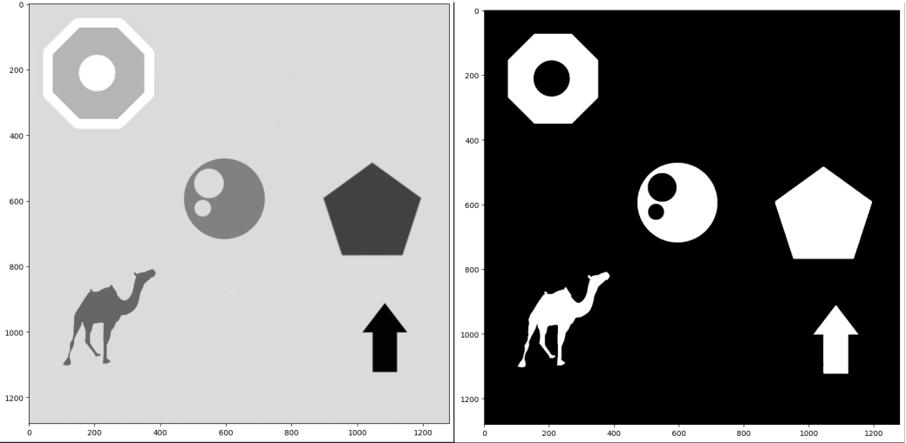
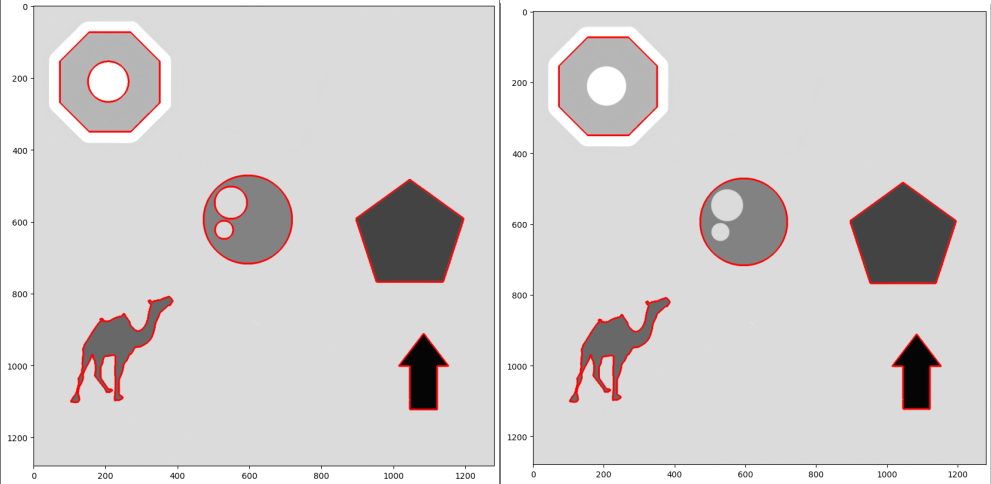
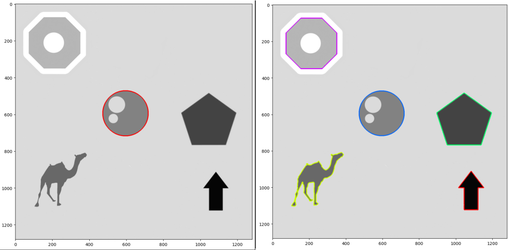
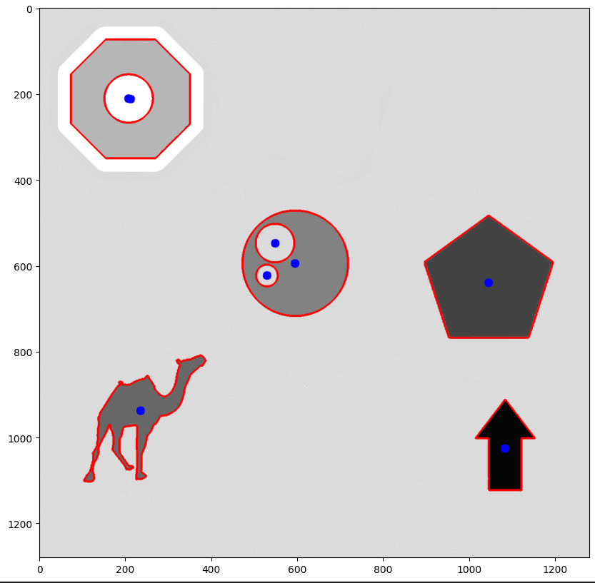
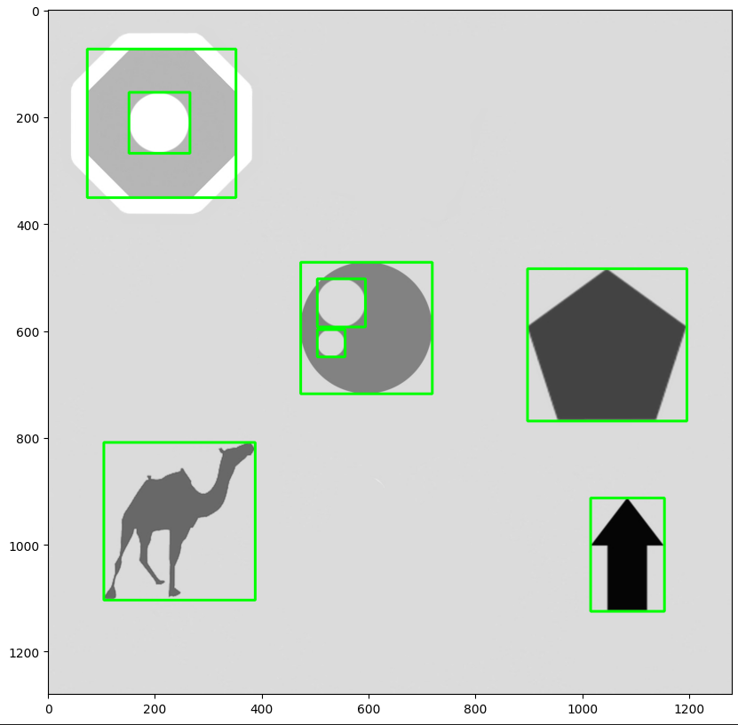
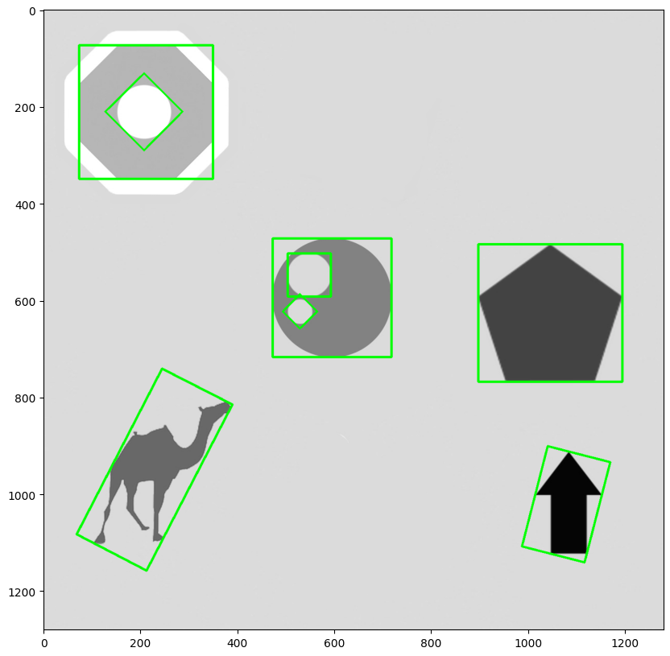
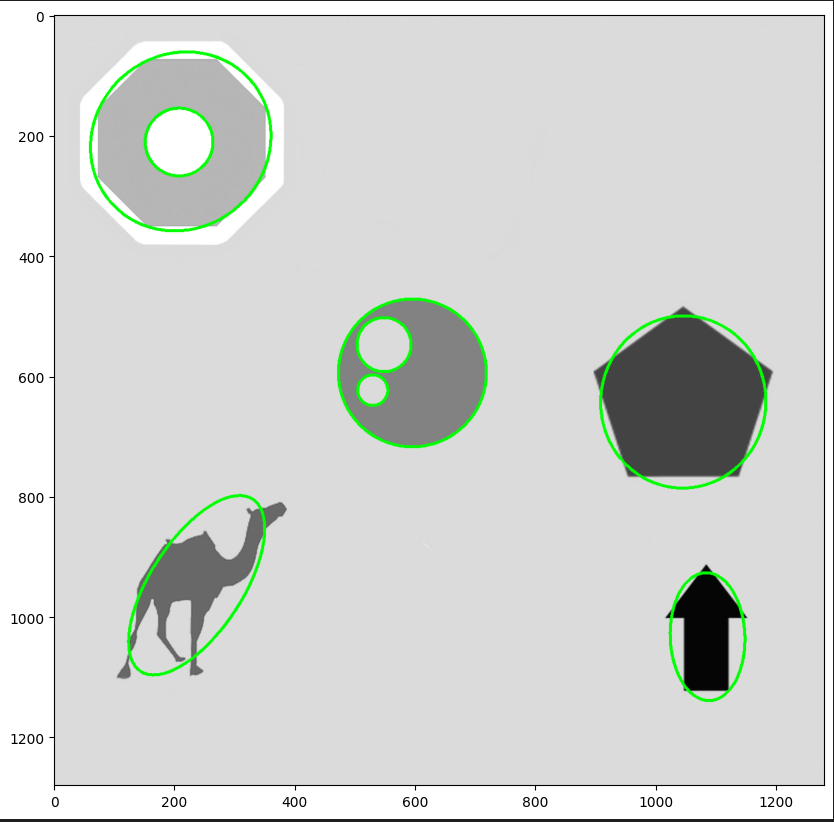
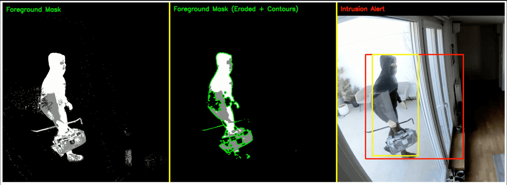

# Module 5: Contour and Shape Analysis

## Concept

### M05.01: Finding and Drawing Contours

Exercises to learn openCV functionality to find contours and extract parameter information from contours generated

First we read this image of stencil shapes as grayscale, and threshold it into a binary mask

With cv2.findContours(), we can retrieve contours and their hierarchy, where contours are a plottable vector of points

* mode = cv2.RETR_LIST will return all contours detected, as shown in the left image
* mode = cv2.RETR_EXTERNAL will filter out contours within other contours, as shown in the right image
* both of these images are created using cv2.drawContours(), which edits it's input image, thus a copy should be used

cv2.drawContours( IDs = -1 ) draws all contours in the list returned by cv2.findContours()

Indexes can alternatively be provided to draw individual contours

cv2 contains a list of functions that take in a contour and output parameter information about the contour

* cv2.moments(contour) returns moment of inertia information about the contour (where constant density is assumed)

* This can be used to calculate a center of mass location from a contour

* cv2.boundingRect(contour) returns x, y, w, h information about a rectangle that spans the size of the contour

* cv2,minAreaRect(contour) returns a vector of points representing another rectangle, but allows the returned rectangle to be rotated to reduce the total area / footprint of it

* cv2.minEnclosingCircle(contour) likewise returns a bounding circle in terms of center and radius 

* cv2.fitEllipse(contour) returns a vector of points representing a non-constant radius circle that may be slanted to reduce the footprint versus a circle

Other notable cv2 methods for contours:

* cv2.contourArea(contour) : calculate the area in pixels squared
* cv2.arcLength(contour) : calculate the total amount of pixels a contour spans

|

|

|

## Module Projects

### M05.02: APPLICATION - Intruder Detection

In this exercise, we want to draw a bounding box around the intruder in these security camera video files

To accomplish this, we expand on the previous motion detection method of Module 04.03:

1. identifying contours in the resultant eroded foreground mask
2. using the largest of the contours to draft a bounding box around what is assumed to be the intruder

This method is only really as good as the erosion of noise on the foreground mask. Without eroding away a significant amount of noise, the bounding box generated does not capture the intruder

* Thus, a 5x5 kernel is used for erosion this time, as opposed to the 3x3 of the prior example
* The output is the yellow bounding box. The red bounding box does not contain contour analysis, it is simply fitting a rectangle to the foreground mask
* Notice the false positives where the yellow bounding box captures the wrong component of the intruder

In order to alleviate the false positives of the previous example:
* an additional step is added to filter contours out if they are below a certain fraction size of the image
* uses the area parameter versus the total area of the image as a ratio

