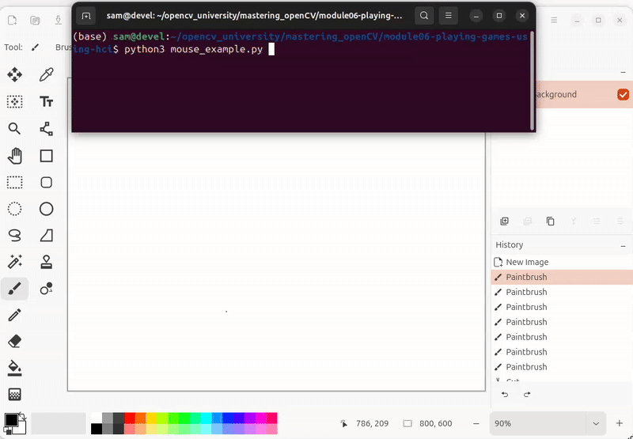
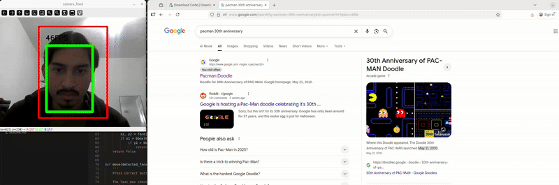

# Module 6: Playing Games with HCIs

## Concept

### M06.01: HCI - PyAutoGUI

Exercises to learn PyAutoGUI library functionality to automate mouse and keyboard functionality

In the first exercise, the mouse click, drag, release is automated for a drawing application to sketch a pattern

In the second exercise, the keyboard shortcuts and typing is automated to open a new tab in a web browser, search for a website, and run the search

|

|

|

## Module Projects

### M05.02: APPLICATION - Web Game

In this application, we use a facial detection DNN model provided, and check where the face bounding box leaves a control box in order to map to arrow key commands on a keyboard

Through this, I am able to play games using facial gestures

Here I am playing Pacman:

Here I am playing Subway Surfers:

