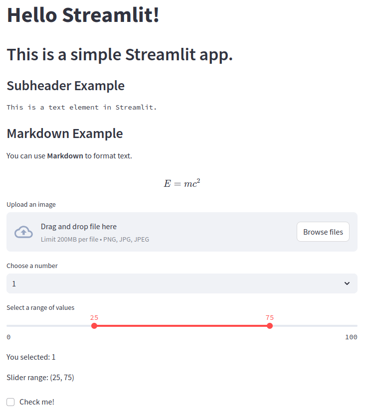

# Module 7: Streamlit

## Concept

### M07.01: Introduction to Streamlit

Exercises to learn streamlit functionality and features

In the first exercise, a web app is created from a python script containing many basic elements 

(text, file collecters, interactive sliders, options, and checkboxes)

|

|

|

### M07.02: Face Detection App using Streamlit

Exercises to understand how openCV can be integrated into a Streamlit web app

In this exercise, the .caffemodel face detection model provided is used in an openCV pipeline to process images provided in the streamlit web app

