# Module 8: Image Filterning 

## Exercises

### M08.01: Image Filtering and Convolution

Exercises to understand how low frequency and high frequency filters are represented as NxN kernels in images that blur or sharpen images

In the first exercise, kitten.jpg is blurred using a box filter. These NxN kernels change the pixel value to be the average value of an NxN box surrounding them at the center

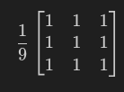 
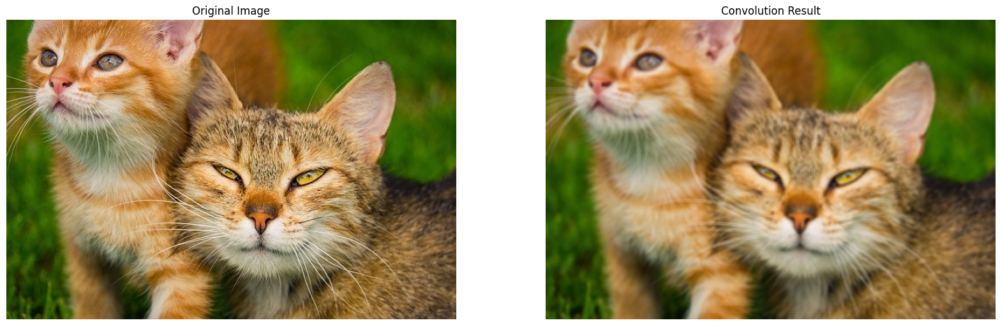

Another method to blur an image is using a Gaussian filter, which calculates the mean of a normal distribution around the central pixel covering an NxN box, defined by a standard deviation

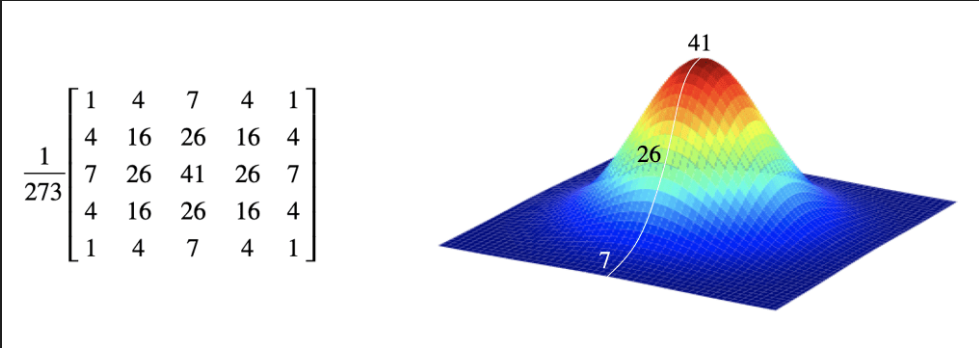
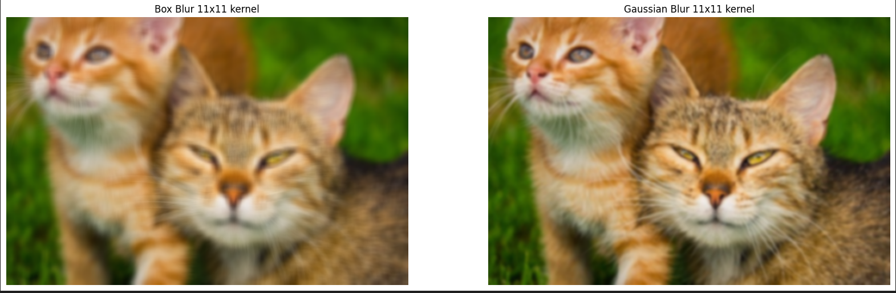

Increasing the standard deviation produces higher blur in the output image

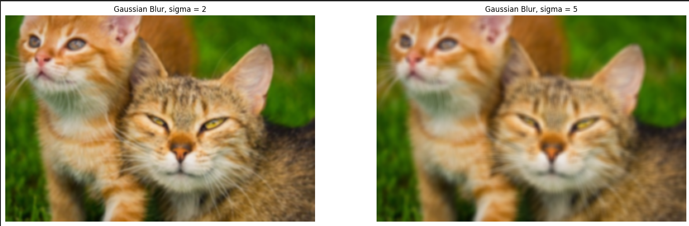

In order to sharpen an image, the kernel type needed resembles this structure, where the central value outweighs its negating surrounding values

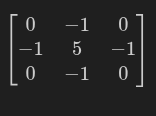
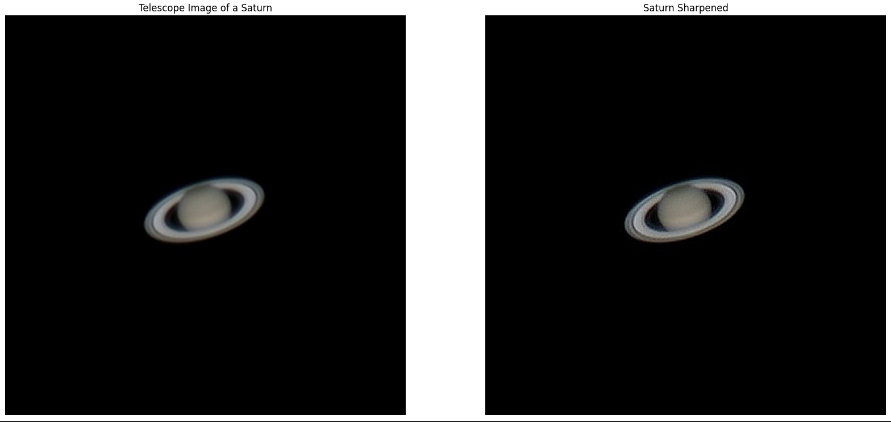

The blurred image of the kittens can be recovered using these sharpening kernels

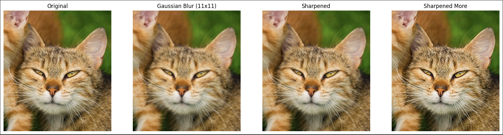

|

|

|

### M08.02: Edge Detection

Exercises to understand the use of convolution kernels to detect edges

First, we explored the Sobel edge detection method, where 3x3 kernels can identify edges in a direction

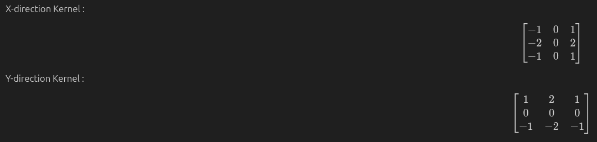

In the first example, we generate a vertical intensity gradient for a grayscale image using the Sobel-X kernel

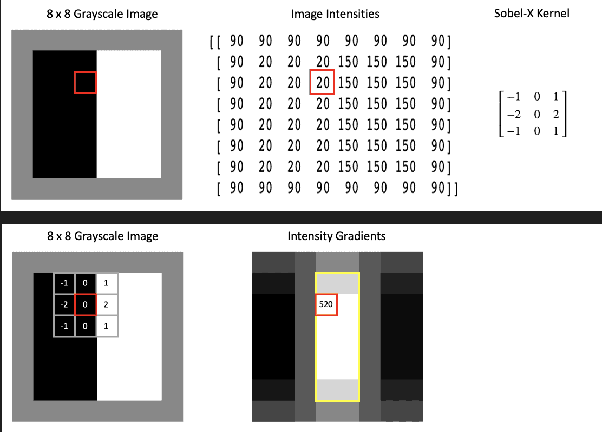

The vertical and horizontal edges are each identified separately, and their edge maps would need to be combined and thresholded in order to collect edges. This can be seen below with the processed checkerboard_color.png

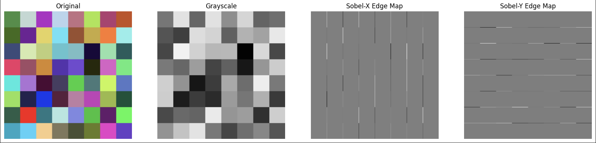

We then discuss the Canny edge detection method, an expansion on the Sobel method where edges above a high threshold value are considered "sure" edges, and edges below that but within a lower threshold value are vetted against these "sure" edges to determine continuity, or else theyre discarded

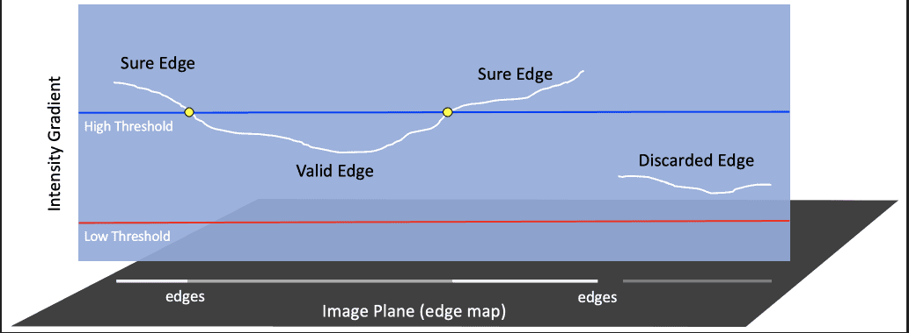

The Canny method can produce reliable edge maps as binary masks, such as this outline of the coca-cola-logo.jpg

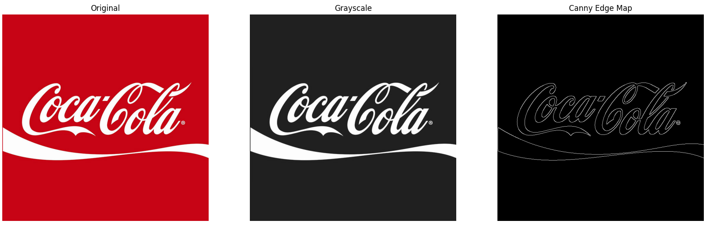

In addition, modifying the upper threshold for the Canny filter can remove edges with lower contrast, such as this gray phone's features from phone_ipad.jpg

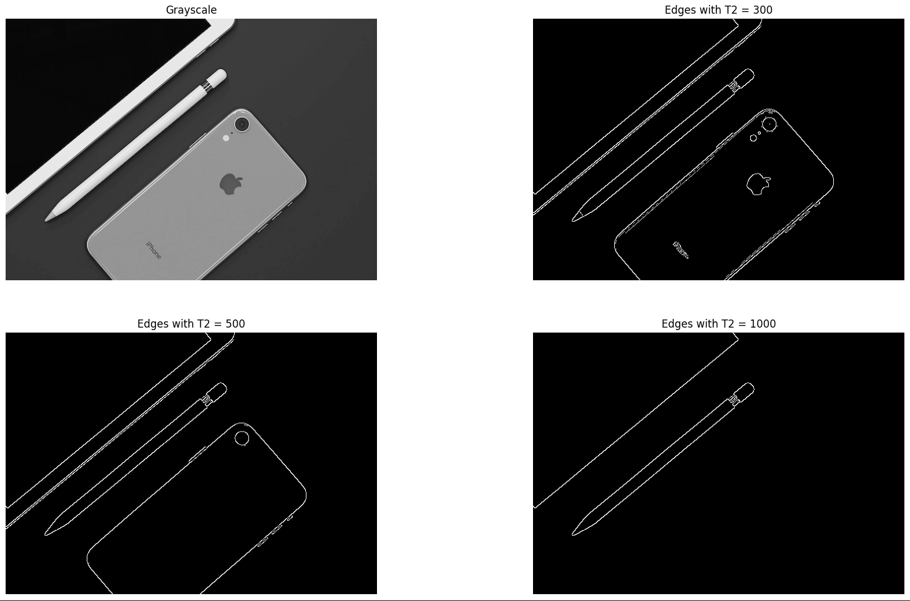

In relation to the prior module, blurring the grayscale image smoothens edges, removing noise present in edge detection as seen below

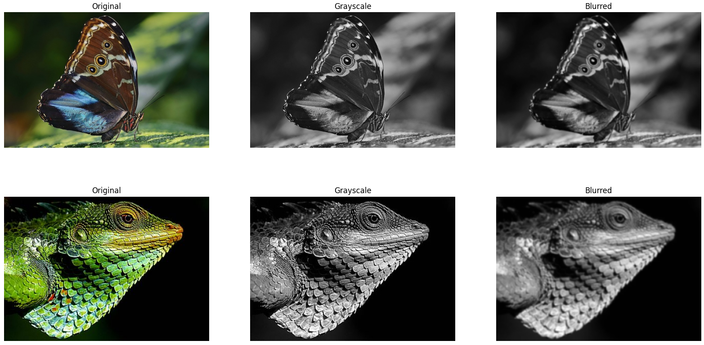
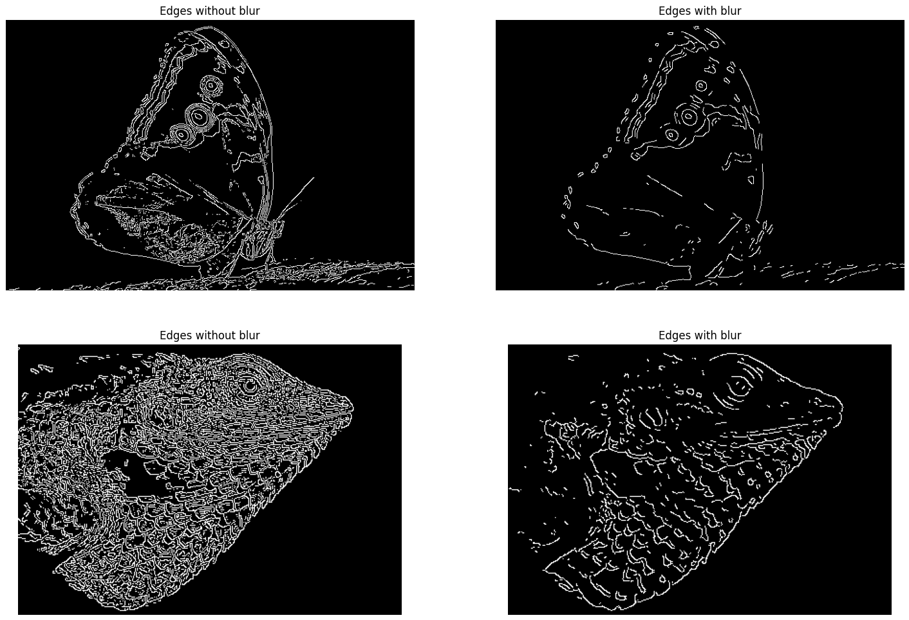

Finally, lowering the lower threshold allows the Canny edge detector to pick up on less sharp edges, such as the antennae of this butterfly

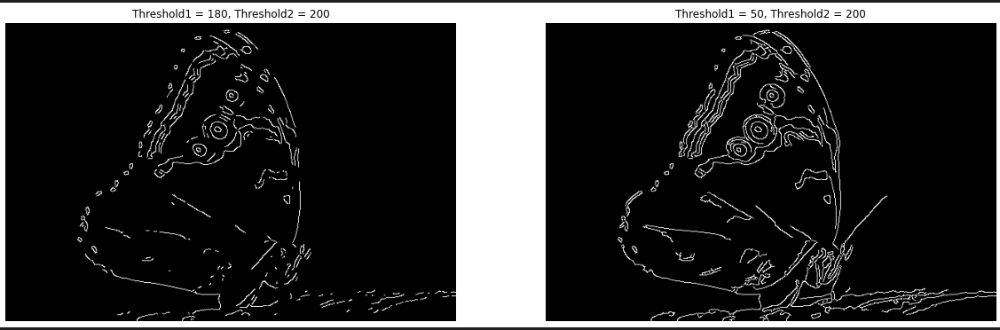

|

|

|

### M08.03: Camera Edge Detection

Exercise to combine reading camera frames with edge detection

The 08_03_Camera_Edge_Detection_Demo.py script accesses the camera on my computer and outputs preview frames and frames that have passed through a Canny filter for edge detection

Below is a gif of myself using it

")

|

|

|

## Applications

### M08.04: Image Filter Effects

Exercises to understand how different image filter effects may be generated using convolutions

Image filters explored:

Sepia / Vintage is generated through a 3x3 kernel

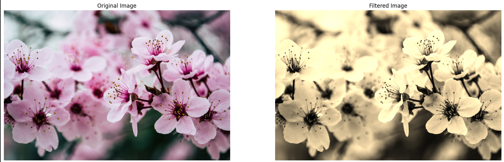

Vignette is generated through gaussian blur encompassing the width and height

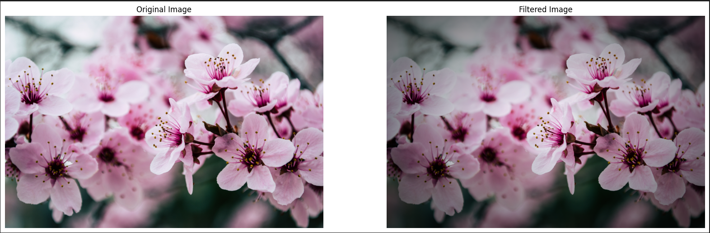

Embossed is generated through a diagonal 3x3 linear filter

Exposure is increased through an absolute scale kernel (abstracted cv2 method)

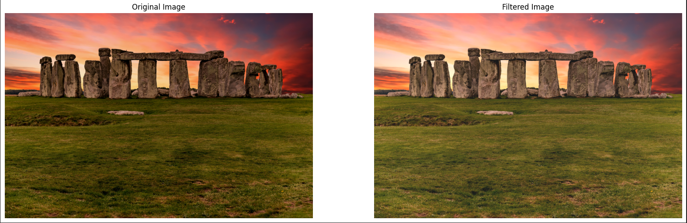

Outlines are sharpened through a 3x3 kernel

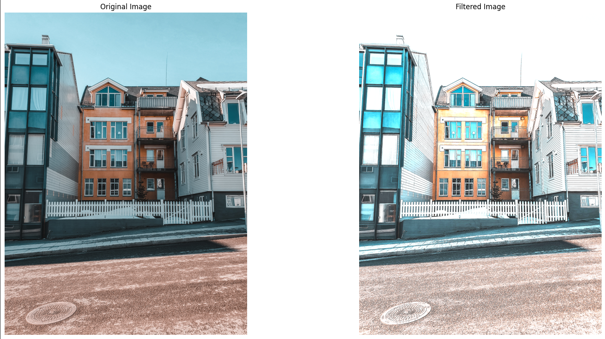

A pencil sketch can be generated from an abstracted cv2 method

This increases outlines on an embossed grayscale image

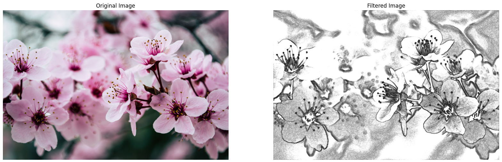

Stylization can similarly be generated from an abstracted cv2 method

An edge detection mask is set to a color value (such as black)

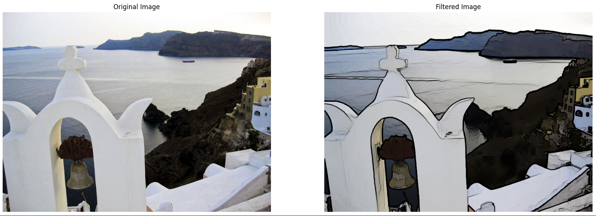

|

|

|

### M08.05: Streamlit Filters App

Expanding on the prior application by turning it into a WebUI with Streamlit

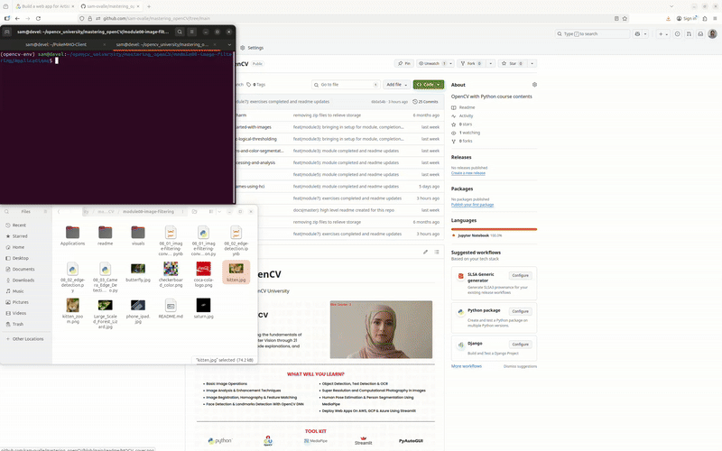