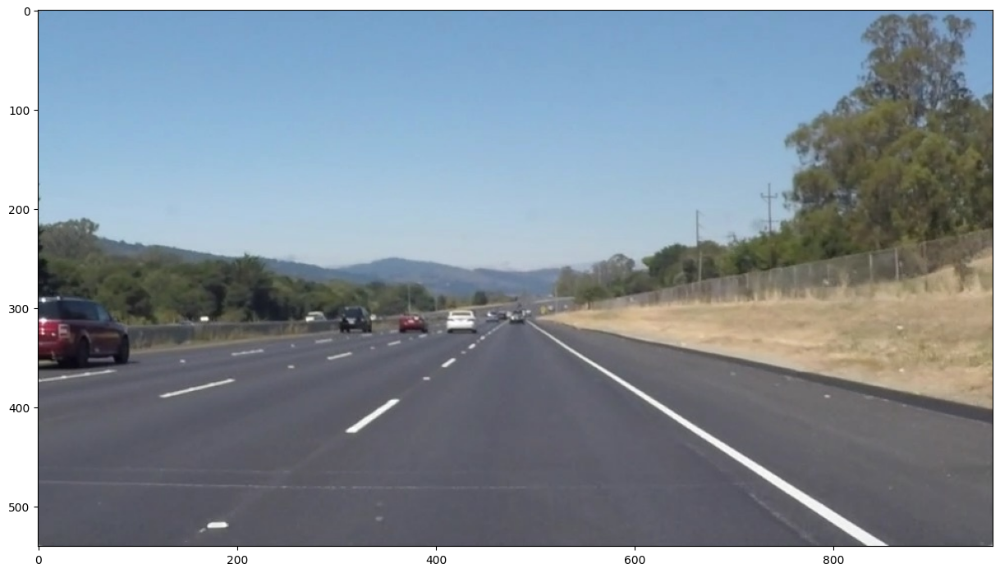
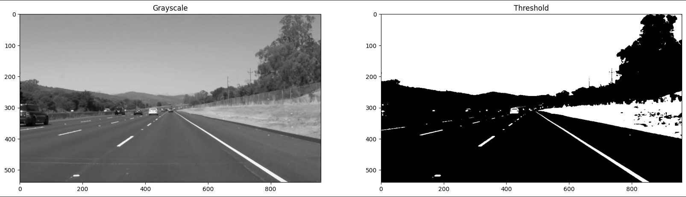
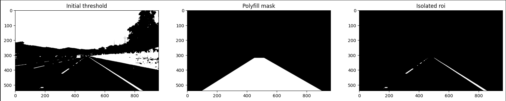
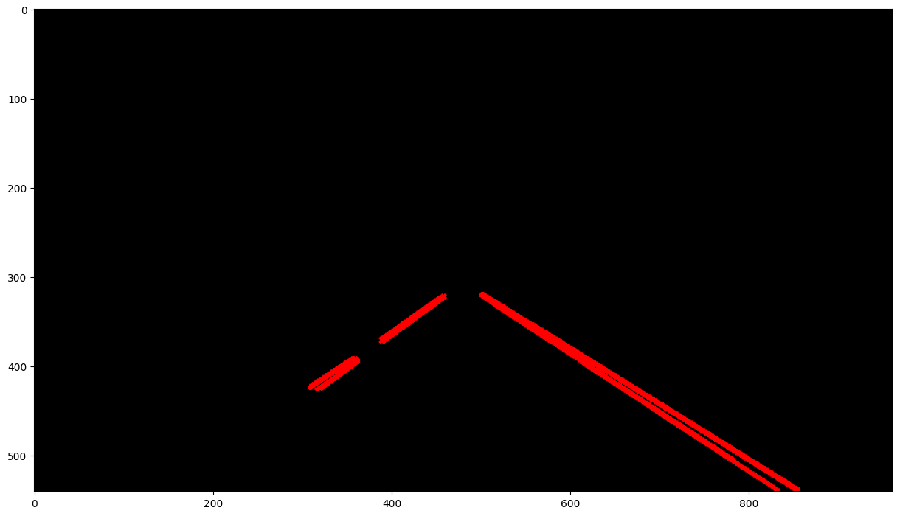
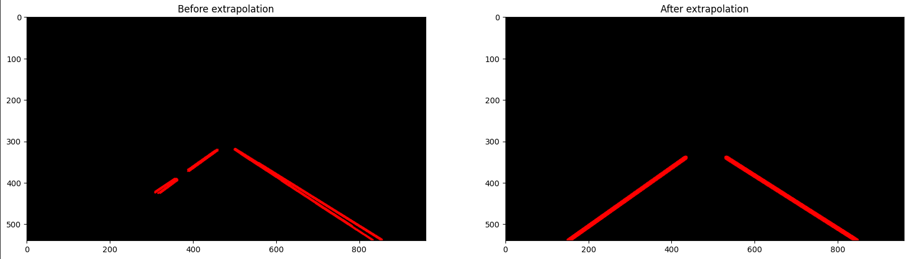
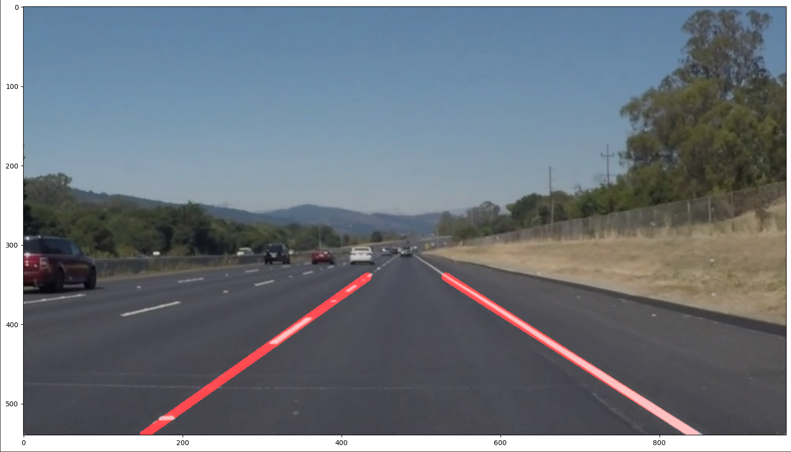

# Module 9: Image Analysis

## Exercises

### M09.01: Lane Detection (Image)

Exercises to understand the pipeline to identify lanes in an image of a road

We are tasked with processing this image of a road from a vehicle on the road, and identifying the lanes this vhicle is driving within

Step 1: Converting the image to grayscale to generate a binary mask (thresholding values above 160)

Step 2: generate a Region of Interest using the fillPoly mask generation method from openCV

Step 3: use a Canny filter to detect edges, and gaussian blur to smoothen the edges

Step 4: Apply a Hough Transform to fit lines given the edges from the Canny filter

Step 5: Collect the left and right lanes based on slope, and extrapolate an average central line for each lane that spans from the bottom of the image to the uppermost point

Step 6: Draw the lanes detected on the original image

|

|

|

### M09.02: Lane Detection (Video)

Exercises to extend the previous pipeline to video frames

We are given the following video of a car driving on a road. Note this gif is sped up 6x

After applying the same pipeline from the images to each frame of the image, this is the output

Note that th polygonal shape of the lane, generated from the start and end points of the lane defining lines, is overlayed on the frames

